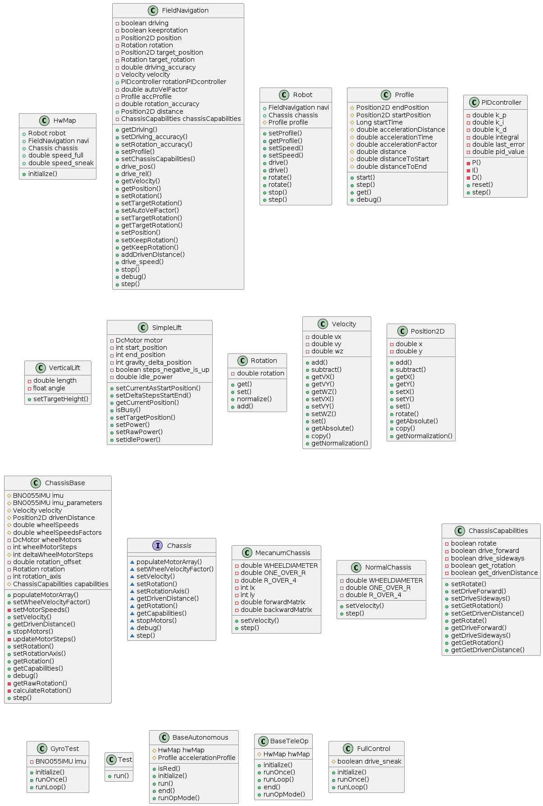

# FTC11515_TeamCode_Base
the base repository for the team code of the FTC team 11515 RobotIGS made to be used as a submodule for forkes of the FTC FtcRobotController repo

**!!! This repo replaces the old repo ([FTC11515_Base](https://github.com/RobotIGS/FTC11515_Base)), which was archived because it was difficult to maintain. !!!**

## UML

