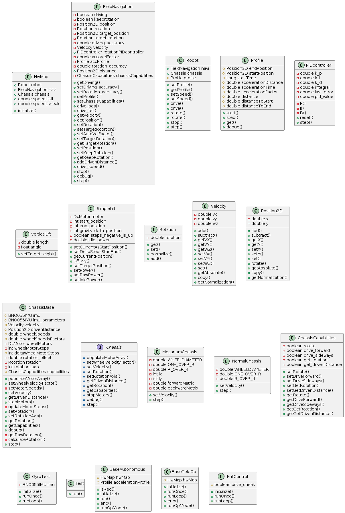

# RobotIGS FTC-Team #11515
## TeamCode Base
This is the repository for the team code of the FTC-Team 11515 RobotIGS.
It is made to be used as a submodule for forkes of the FTC FtcRobotController repo.

## UML

